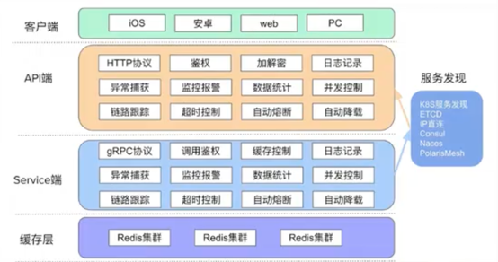
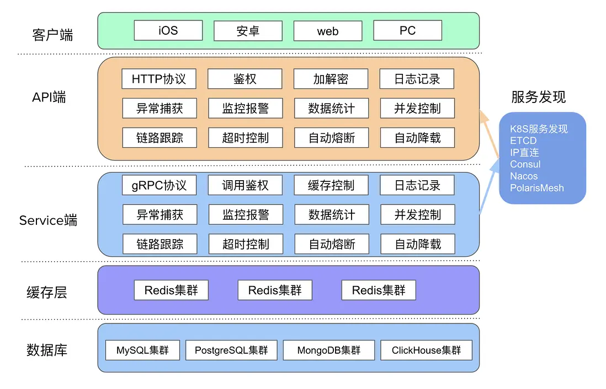

## 微服务
### 远程过程调用服务

**微服务架构:** 微服务架构是一种具体的设计实现或者设计方案，是将复杂的系统使用组件化的方式进行拆分，并使用轻量级通讯方式进行整合的一种设计方法。

**微服务:** 微服务是微服务架构具体的实现方案，是通过微服务架构设计方法拆分出来的一个独立的组件化的小应用。
微服务架构定义的精髓，可以用一句话来描述，那就是”分而治之，合而用之”。将复杂的系统进行拆分的方法，就是“分而治之”。分而治之，可以让复杂的事情变的简单，这很符合我们平时处理问题的方法。 使用轻量级通讯等方式进行整合的设计，就是”合而用之”的方法，合而用之可以让微小的力量变动强大。
    

# go-zero

go-zero 是一个集成了各种工程实践的 web 和 rpc 框架。通过弹性设计保障了大并发服务端的稳定性，经受了充分的实战检验。

## 根据业务逻辑拆分源
增加项目可用性

### 需要解决的问题
1. 需要解决服务之间的通信
2. 如何找到对应的服务地址

一个服务创建一个文件夹

